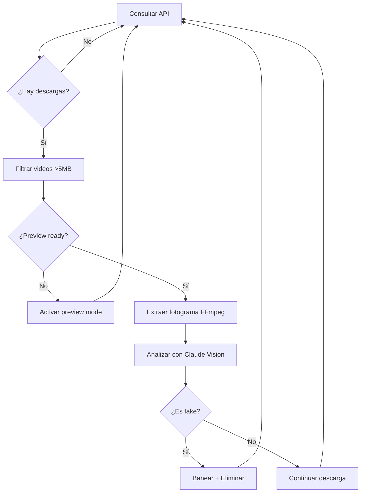

# Vision Auditor - Análisis Visual Automático

Herramienta de auditoría visual automática para detectar archivos fake en descargas de eMule usando FFmpeg y Claude Vision.

## 🎯 Características

- ✅ Consulta automática de descargas activas
- ✅ Filtrado inteligente (solo videos con >5MB)
- ✅ Activación automática de preview mode
- ✅ Extracción de fotogramas con FFmpeg
- ✅ Análisis con Claude 3.5 Sonnet Vision
- ✅ Acciones automáticas (cancelar, banear)
- ✅ Logging completo y estadísticas

## 📋 Requisitos

### Software

- **Python 3.8+**
- **FFmpeg** (instalado y en PATH)
- **eMule-Aishor R1.3** con API LLM activa

### APIs

- **Anthropic API Key** (para Claude Vision)
- **eMule API Key** (configurada en eMule)

## 🚀 Instalación

### 1. Instalar FFmpeg

**Windows:**
```powershell
# Con Chocolatey
choco install ffmpeg

# O descargar desde https://ffmpeg.org/download.html
# Y añadir a PATH
```

**Linux:**
```bash
sudo apt install ffmpeg
```

### 2. Instalar dependencias Python

```bash
cd tools
pip install -r requirements.txt
```

### 3. Configurar API Keys

Obtener API Key de Anthropic:
- Ir a https://console.anthropic.com/
- Crear cuenta y generar API Key

Obtener API Key de eMule:
- Abrir eMule-Aishor
- Ir a Preferencias → API LLM
- Copiar o generar API Key

## 💻 Uso

### Modo Continuo (Recomendado)

Ejecutar auditoría cada 5 minutos:

```bash
python vision_auditor.py \
  --api-key "YOUR_EMULE_API_KEY" \
  --anthropic-key "YOUR_ANTHROPIC_KEY"
```

Con intervalo personalizado (cada 10 minutos):

```bash
python vision_auditor.py \
  --api-key "YOUR_EMULE_API_KEY" \
  --anthropic-key "YOUR_ANTHROPIC_KEY" \
  --interval 600
```

### Modo Una Vez

Ejecutar un solo ciclo de auditoría:

```bash
python vision_auditor.py \
  --api-key "YOUR_EMULE_API_KEY" \
  --anthropic-key "YOUR_ANTHROPIC_KEY" \
  --once
```

### Opciones Avanzadas

```bash
python vision_auditor.py \
  --api-url "http://localhost:4711/api/v1" \
  --api-key "YOUR_EMULE_API_KEY" \
  --anthropic-key "YOUR_ANTHROPIC_KEY" \
  --interval 300 \
  --once
```

**Parámetros:**
- `--api-url`: URL de la API de eMule (default: http://localhost:4711/api/v1)
- `--api-key`: API Key de eMule (requerido)
- `--anthropic-key`: API Key de Anthropic (requerido)
- `--interval`: Intervalo entre ciclos en segundos (default: 300)
- `--once`: Ejecutar solo un ciclo y salir

## 📊 Funcionamiento

### Flujo de Trabajo



### Criterios de Detección

El script analiza cada fotograma y Claude Vision determina:

**REAL** - Contenido legítimo:
- Escenas de películas/series
- Documentales
- Contenido de video válido

**FAKE** - Contenido spam:
- Publicidad
- Pantallas negras
- Errores de codec
- Contenido no relacionado
- Spam/malware

### Umbral de Confianza

- **Confianza > 70%**: Acción automática (eliminar + banear)
- **Confianza < 70%**: Solo logging, no acción

## 📝 Logs

Los logs se guardan en `vision_auditor.log`:

```
2026-01-10 14:30:00 - INFO - Vision Auditor iniciado
2026-01-10 14:30:01 - INFO - Encontradas 3 descargas activas
2026-01-10 14:30:05 - INFO - Auditando: Movie.2024.1080p.mkv
2026-01-10 14:30:10 - INFO - Fotograma extraído: temp_frames/frame_ABC123.jpg
2026-01-10 14:30:15 - INFO - Análisis: REAL (confianza: 0.95)
2026-01-10 14:30:15 - INFO - ✅ REAL: Movie.2024.1080p.mkv (confianza: 95%)
```

### Estadísticas

Al final de cada ciclo:

```
==================================================
ESTADÍSTICAS:
  Total analizados: 15
  Fakes detectados: 2
  Archivos reales: 13
  Errores: 0
==================================================
```

## ⚙️ Configuración Avanzada

### Modificar Timestamp de Extracción

Por defecto extrae a los 5 minutos. Para cambiar:

```python
# En vision_auditor.py, línea ~140
def extract_frame(self, file_path: str, output_path: str, timestamp: str = "00:10:00"):
    # Ahora extrae a los 10 minutos
```

### Ajustar Umbral de Confianza

```python
# En vision_auditor.py, línea ~380
if result.verdict == "FAKE" and result.confidence > 0.8:  # Cambiar de 0.7 a 0.8
    # Más conservador, solo elimina con 80%+ confianza
```

### Cambiar Progreso Mínimo

```python
# En vision_auditor.py, línea ~330
if completed_size < 10 * 1024 * 1024:  # Cambiar de 5MB a 10MB
    # Requiere más progreso antes de analizar
```

## 🔧 Troubleshooting

### FFmpeg no encontrado

```
Error: ffmpeg not found in PATH
```

**Solución:** Instalar FFmpeg y añadir a PATH

### Error de API Key

```
Error: 401 Unauthorized
```

**Solución:** Verificar que las API Keys sean correctas

### Timeout de FFmpeg

```
Error: FFmpeg timeout para archivo.part
```

**Solución:** El archivo puede estar corrupto o el codec no soportado. El script continuará con el siguiente archivo.

### Claude API Rate Limit

```
Error: 429 Too Many Requests
```

**Solución:** Aumentar el intervalo entre ciclos (`--interval 600`)

## 📈 Mejoras Futuras

- [ ] Soporte para múltiples fotogramas por archivo
- [ ] Análisis de audio para detectar idioma incorrecto
- [ ] Integración con TMDb para validar metadata
- [ ] Dashboard web para visualizar estadísticas
- [ ] Notificaciones (email, Telegram, Discord)
- [ ] Whitelist de fuentes confiables
- [ ] Machine learning local (sin API externa)

## 🤝 Contribuir

Para reportar bugs o sugerir mejoras:
1. Abrir issue en GitHub
2. Incluir logs relevantes
3. Describir comportamiento esperado vs actual

## 📄 Licencia

GPL v2 - Mismo que eMule-Aishor

---

**Proyecto:** eMule-Aishor Vision Verification  
**Versión:** R1.3  
**Autor:** Aishor Team
